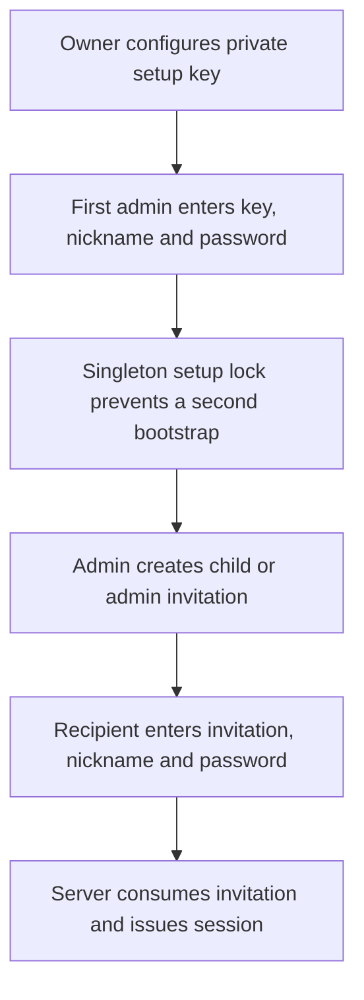
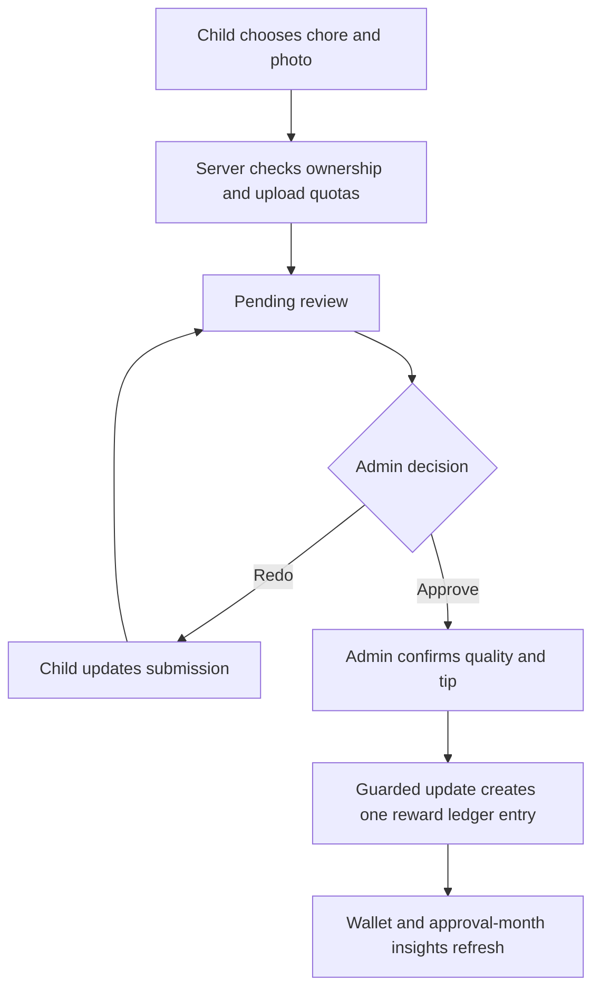
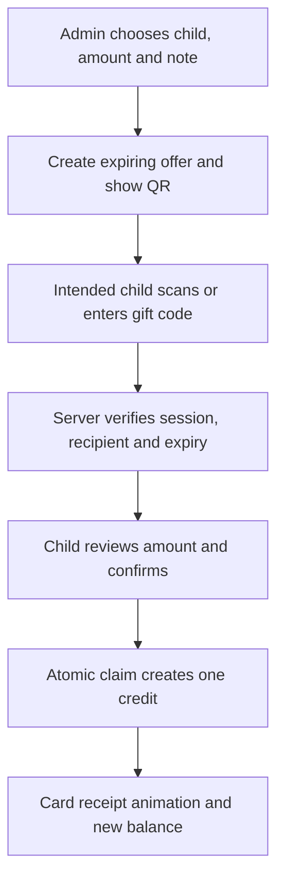
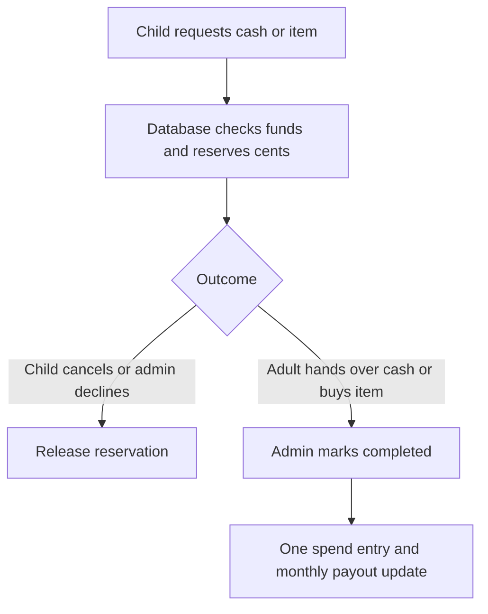

# App flows

## Account setup and invitations

```mermaid
flowchart TD
  A[Owner configures private setup key] --> B[First admin enters key, nickname and password]
  B --> C[Singleton setup lock prevents a second bootstrap]
  C --> D[Admin creates child or admin invitation]
  D --> E[Recipient enters invitation, nickname and password]
  E --> F[Server consumes invitation and issues session]
```

## Chore review

```mermaid
flowchart TD
  A[Child chooses chore and photo] --> B[Server checks ownership and upload quotas]
  B --> C[Pending review]
  C --> D{Admin decision}
  D -->|Redo| E[Child updates submission]
  E --> C
  D -->|Approve| F[Admin confirms quality and tip]
  F --> G[Guarded update creates one reward ledger entry]
  G --> H[Wallet and approval-month insights refresh]
```

## Gift QR

```mermaid
flowchart TD
  A[Admin chooses child, amount and note] --> B[Create expiring offer and show QR]
  B --> C[Intended child scans or enters gift code]
  C --> D[Server verifies session, recipient and expiry]
  D --> E[Child reviews amount and confirms]
  E --> F[Atomic claim creates one credit]
  F --> G[Card receipt animation and new balance]
```

## Cash and purchases

```mermaid
flowchart TD
  A[Child requests cash or item] --> B[Database checks funds and reserves cents]
  B --> C{Outcome}
  C -->|Child cancels or admin declines| D[Release reservation]
  C -->|Adult hands over cash or buys item| E[Admin marks completed]
  E --> F[One spend entry and monthly payout update]
```

These records do not transfer bank funds. Adults fulfill cash and purchases outside the app.
